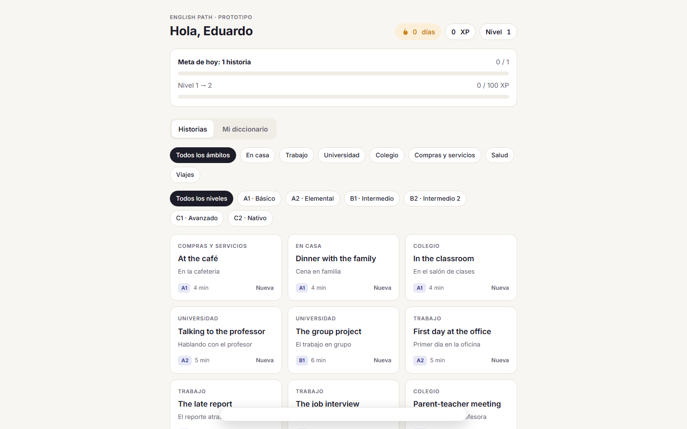

# Portafolio

Muestras de los proyectos en los que estoy trabajando. Cada carpeta tiene una descripción del proyecto, las tecnologías que uso y capturas de pantalla.

| Proyecto | Qué es | Estado |
|---|---|---|
| [English Path](english-path/) | App para que hispanohablantes aprendan inglés de A1 a C2 con historias cotidianas, práctica oral y repaso de vocabulario. | Prototipo web y app móvil (PWA) funcionando; backend en diseño |
| [Diario de Estudio](racha-estudio/) | Registro de sesiones de estudio con contador de racha diaria. | Terminado (versión 1) |

  
  

