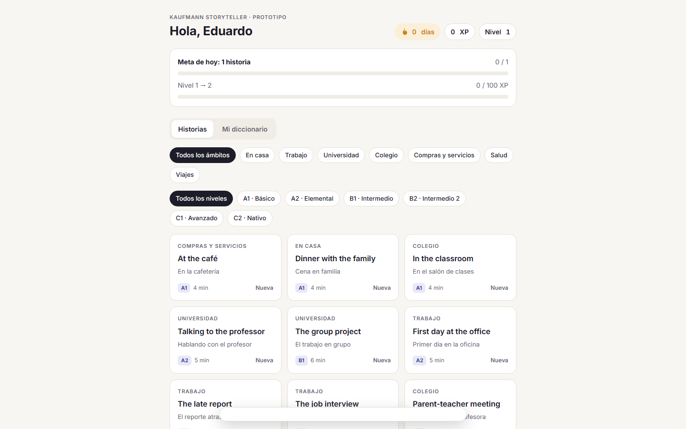
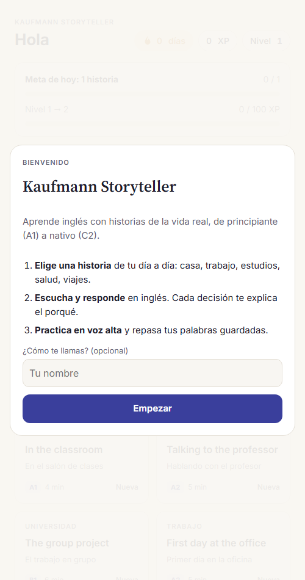
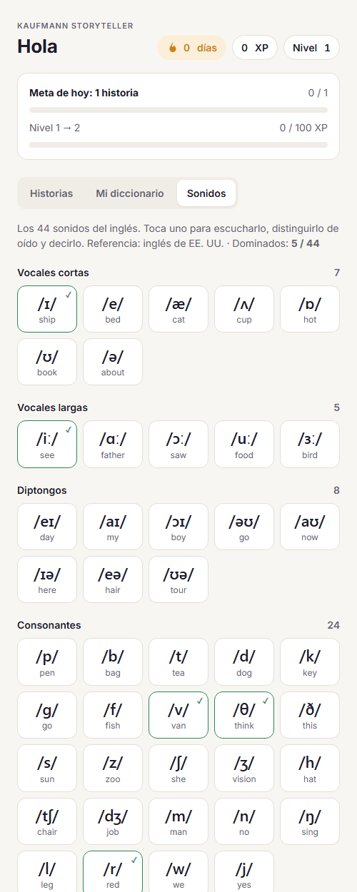
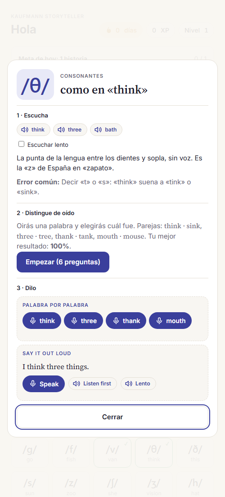

# Kaufmann Storyteller

Plataforma para que hispanohablantes aprendan inglés **de cero (A1) a dominio (C2)** con historias de la vida cotidiana, personajes recurrentes, práctica oral y repaso espaciado.

## Capturas

| Prototipo web | App en el celular (PWA) |
|---|---|
|  |  |

| Los 44 sonidos | Práctica de un sonido |
|---|---|
|  |  |

## Qué hace hoy

- **18 historias** de niveles A1 a C2, agrupadas por ámbito: en casa, trabajo, universidad, colegio, compras y servicios, salud y viajes.
- **Ejercicios** dentro de cada historia: cada decisión explica por qué es correcta o no.
- **Práctica oral** con reconocimiento de voz del navegador: escucha normal o lenta, palabras no reconocidas en rojo (se tocan para oírlas despacio), mejor intento por frase y una pista del sonido que conviene practicar.
- **Los 44 sonidos del inglés** (referencia EE. UU.): ejemplos, consejo de articulación en español, error típico de hispanohablantes y diferencias del inglés americano. Incluye ejercicios de **pares mínimos** (*ship / sheep*, *very / berry*, *think / sink*) para entrenar el oído y práctica con micrófono palabra por palabra.
- **Diccionario personal** para guardar palabras y repasarlas después.
- **Meta diaria, racha, XP y niveles** para mantener la constancia.
- **Instalable en el celular** (PWA) y funciona sin conexión.
- **Voces reales** generadas con ElevenLabs mediante un script propio (`generate-audio.mjs`) que crea los audios y su manifiesto.

## Diseño del producto completo

Antes de programar el backend documenté el producto completo:

- Requisitos funcionales y no funcionales con identificadores trazables (RF-01…RF-25).
- Arquitectura y decisiones técnicas (ADR).
- **Modelo de datos de 45 tablas** en Prisma, validado, con Row Level Security en SQL.
- 17 pantallas de UX y las reglas pedagógicas: lección de 12 pasos, desbloqueo por dominio (≥ 80 %) y repaso espaciado con FSRS.
- Plan de implementación por etapas.

## Tecnologías

- **Prototipo y PWA:** HTML, CSS y JavaScript, service worker y Web Speech API.
- **Audio:** Node.js y ElevenLabs (TTS).
- **Plataforma (en diseño):** Next.js 15, TypeScript, Tailwind, shadcn/ui, Supabase (Postgres, Auth, Storage), Prisma, Anthropic API (tutor IA), Vercel y Expo.

## Estado

Prototipo web y app móvil funcionando con el progreso guardado en el dispositivo. Siguiente paso: backend con cuentas y progreso en la nube.
