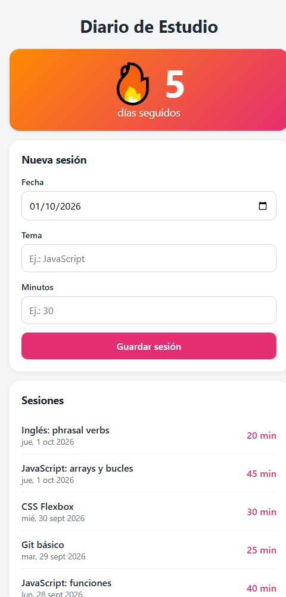

# Diario de Estudio

App web sencilla para registrar sesiones de estudio y mantener una **racha de días seguidos**.

*La captura usa datos de ejemplo.*

## Qué hace

- Registra cada sesión con **fecha, tema y minutos**.
- Calcula la **racha** de días consecutivos con al menos una sesión. Si hoy todavía no estudiaste, la racha sigue viva hasta que termine el día.
- Muestra el historial de sesiones, de la más reciente a la más antigua.
- Guarda todo en el navegador (`localStorage`), así que no necesita servidor ni cuenta.

## Detalles técnicos

- Las fechas se manejan siempre en **hora local** y nunca en UTC, para que la racha no se rompa por la zona horaria (por ejemplo, en Perú, UTC-5).
- Validación en el formulario (HTML) y otra vez en JavaScript.
- Hecho con HTML, CSS y JavaScript puro, sin librerías.

## Tecnologías

HTML · CSS · JavaScript
